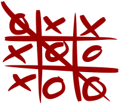

# Tic-Tac-Toe

> Built with Ruby and playable in the command line - the classic Tic-Tac-Toe Game!

This Tic-Tack-Toe game was built for the command line and it uses the Ruby Daru gem to build the board.

## Built With

- Ruby
- Ruby Daru Gem

## Getting Started

To get a local copy up and running follow these simple example steps.

### Prerequisites

Clone this project running the following command in your terminal: `git clone git@github.com:Azeem838/tic-tac-toe.git`

### Setup

Navigate to the folder where the project has been cloned

### Install

Install the Daru Gem by running `gem install daru`

### Usage

1. Just run `bin/main.rb` in your terminal to start the game!
2. When prompted, enter the names of Player1 and Player2.
3. When prompted, select who is going to play first.
4. A 3x3 game board is shown with numbers.
5. Enter the number which corresponds to the point where you will play.
6. Ignore the numbers on the left most side and the letters at the top of the board.
7. The players name will show up when it is their turn to play.

### Game Rules

1. Player 1 and Player 2 will use symbol "X" and "Y" respectively.
2. The first person to get 3 of their symbols in a row is the winner!
3. The 3 symbols have to be in a either a horizontal, a vertical or diagonal row to win.
4. 3 Symbols scattered across the board will not count as a win.

## Authors

👤 **Njgouh Abdoulaye Razak**

- Github: [@AbdoulayeRazak](https://github.com/Abdoulaye-Thespy)

👤 **Azeem Ahmed**

- Github: [@Azeem838](https://github.com/Azeem838)

## 🤝 Contributing

Contributions, issues and feature requests are welcome!

Feel free to check the [issues page](https://github.com/Azeem838/tic-tac-toe/issues).

## Show your support

Give a ⭐️ if you like this project!

## 📝 License

This project is [MIT](lic.url) licensed.
